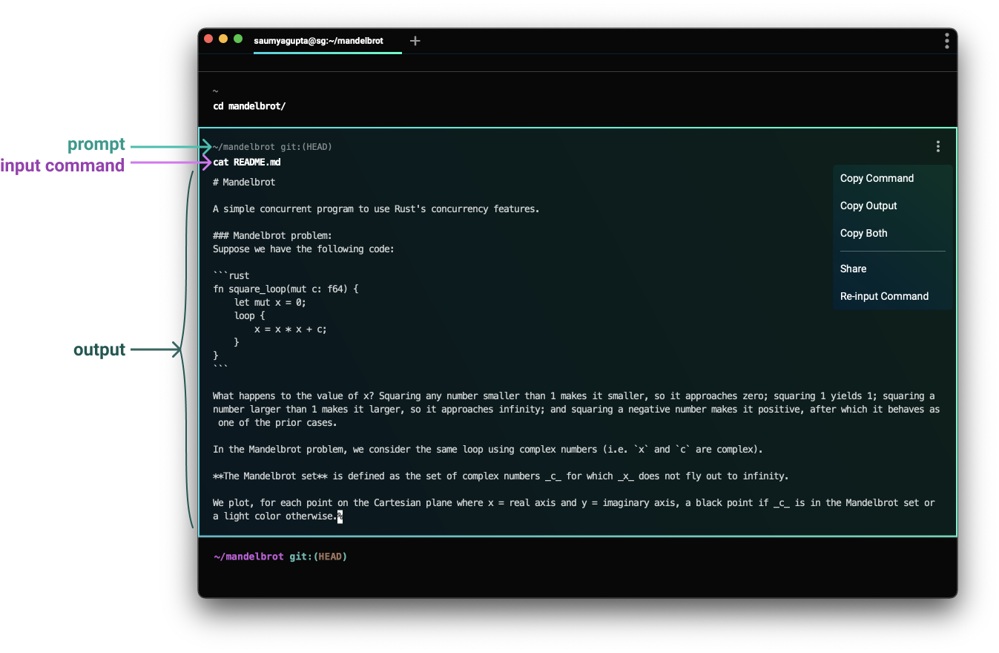

Let's explain what WebTerminal seeks to achieve by comparing it to other projects that have innovated in this space, and examine the **advances** that they've made, and also their **limitations** compared to WebTerminal's goals.

1. [Nushell](#header-nushell)
1. [PowerShell](#header-powershell)
1. [Warp](#header-warp)
1. [Mathematica](#header-mathematica)

### Warp

> [Warp.dev](https://www.warp.dev/) is a modern, Rust-based terminal with AI built in so you and your team can build great software, faster.

**Advances:** Warp has many great ideas about how to improve the classic terminal user experience. Out of all the other projects out there, Warp is probably the closest to what we'd like to achieve with WebTerminal.

Its concept of commands producing [Blocks](https://docs.warp.dev/features/blocks) is exactly the kind of UX we'd like to have in WebTerminal:

    

**Limitations:** Although Warp innovates on the experience of the classic terminal, it seems to be designed primarily around traditional terminal emulation, in the context of its enriched UI. It doesn't seem to provide the capability for commands to produce rich graphical output.

We expect that WebTerminal will use a very similar user experience to Warp for when users interact with the classic terminal and its programs; however, we'd like to go beyond what it offers by making the default display graphical and compelling enough to be preferable as a default.

### Nushell

[Nushell](https://www.nushell.sh/) is an attempt to significantly improve the command-line shell.

**Advances:** In Nushell, commands accept structured input, and produce structured output, such as lists and tables. Nushell is also a shell language designed to make manipulating this structured data easy. Its capabilities can be concisely demonstrated with the following screenshot showing a sample command and its output: 

     

This picture shows a command being run, `ls | where size > 10mb | sort-by modified`. The `ls` command produces table-like structured data; `where size > 10mb` filters rows based on their `size` column; and `sort-by modified` sorts them by the `modified` column. The output is displayed as a table, and demonstrates some semantic understanding of the content, e.g., displaying the modification time as "a year ago".

**Limitations:** However, Nushell has a fundamental limtiation: it is designed to operate within existing character-based terminals. Nushell can't display data graphically or interactively. WebTerminal aims to take advantage of the display powers of web technology, using WebView as the canvas.

Nushell is also designed around its custom shell programming language, [Nu](https://www.nushell.sh/book/nu_fundamentals.html). While Nu has a good foundation, we think that there's an opportunity to improve shell languages further, and design one more specifically for use with both structured output and a graphical display.

### Mathematica

[Mathematica](https://www.wolfram.com/mathematica/) may have been the first environment that implements the "notebook" UI model. Mathematica is an advanced notebook environment designed around mathematics and computation.

**Advances:** Mathematica commands and their outputs are displayed visually, directly in the terminal-style interface:

    

The output of commands can also be interactive, and users can interact with sliders and other widgets to manipulate it. Jupyter provides a similar experience: 

    

**Limitations:** Mathematica and Jupyter are designed to be specialized tools; they are not designed or optimized to be a primary command-line interface. They are not the terminal that you use to run e.g. `git commit` or `npm` or `yarn` on another project. I don't believe they have built-in terminal emulation capabilities, making them unsuitable for running classic programs.

WebTerminal aims to accommodate these daily-driver use-cases while also providing an advanced UI.

### PowerShell

> [PowerShell](https://learn.microsoft.com/en-us/powershell/) is a cross-platform task automation solution made up of a command-line shell, a scripting language, and a configuration management framework. [...] Unlike most shells that only accept and return text, PowerShell accepts and returns .NET objects.

**Advances:** PowerShell inspires WebTerminal in that we'd like commands to accept and return JavaScript objects (not just JSON or Ion).

Because PowerShell commands can return full-fledged objects, users can interact with them as such -- dynamically discovering properties on returned objects, and searching for other commands that interact with those objects.

**Limitations:** PowerShell doesn't have graphical output, however, whereas with WebTerminal we'd like to design the experience around rich web UI capabilities.

To learn more about PowerShell, see [PowerShell 101](https://learn.microsoft.com/en-us/powershell/scripting/learn/ps101/00-introduction?view=powershell-7.3)