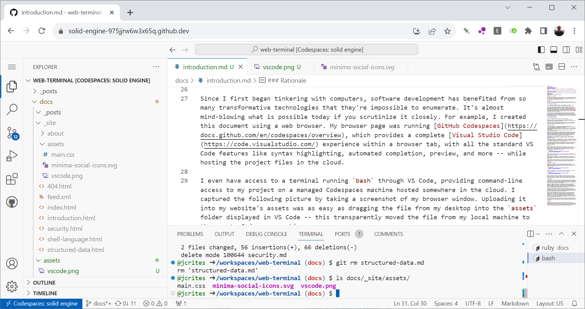

**WebTerminal is an effort to re-imagine the interactive command-line terminal using modern browser and Web technology.**

**Author:** [Justin Crites](https://github.com/jcrites) ([HN](https://news.ycombinator.com/user?id=jcrites))
**Status:** Draft
**Version:** 1.4.1 (2023-10-05 13:58:00 PDT)

### Elevator Pitch (TL;DR)

WebTerminal is a command-line environment designed around displaying data using a WebView, not a grid of characters. When users run commands, output is displayed in a rich visual way, taking advantage of HTML, CSS, and JavaScript. Output can consist of everything to simple lists and tables to complex, interactive UI widgets.

WebTerminal is a technology that I wish existed, and wish that I could use, so I'm trying to create it. (Alternatives come close, but don't hit the mark.) My intention is to release this technology as open-source software; there is no commercial motivation or business deadline at the moment. I see this project as R&D work.

### Motivation

**TL;DR:** Transformative technologies have changed nearly every aspect of software development, yet the terminal has remained essentially unchanged and unimproved for decades.

>  “Any sufficiently advanced technology is indistinguishable from magic” -- Arthur C. Clarke. Profiles of the Future: An Inquiry into the Limits of the Possible

Since I first began tinkering with computers, software development has benefited from so many transformative technologies that they're impossible to enumerate. It's almost mind-blowing what is possible today if you think about it. Technologies like Git, containers, Integrated Development Environments, and Infrastructure-as-Code have radically changed the way many developers work.

For example, I created this document in a web browser. My browser was running [GitHub Codespaces](https://docs.github.com/en/codespaces/overview), which provides a complete [Visual Studio Code](https://code.visualstudio.com/) experience within a browser tab, with all the standard VS Code features like syntax highlighting, automated completion, preview, and more -- while hosting the project files in the cloud. I even have access to a `bash` terminal in VS Code that provides command-line access to my project, hosted on that anonymous Codespace cloud machine.

I captured the following picture by taking a screenshot of my browser window. Uploading it into my website's assets was as easy as dragging the file from my desktop into the `assets` folder displayed in VS Code -- this transparently moved the file from my local machine to the remote Codespace machine.

| 
|:--:|
| A screenshot of VS Code running in a browser tab. Note the terminal at the bottom |

I never would have imagined that something like this was possible even 10 years ago.

#### The terminal has not improved

The project originates from an observation: terminal technology has been stagnant for decades, even as web technologies and others have innovated substantially.

Traditional terminals, rooted in 1960s teletype technology, utilize characters and ANSI escape codes to render limited user interfaces, and their development has been somewhat arrested due backward compatibility and their inherently character-based output. The contrast with the modern Web is stark. WebTerminal seeks to innovate on the terminal experience by integrating modern Web technologies, using HTML, CSS, and JavaScript for display, along with a processing paradigm that can take advantage of them.

## Inspiration

To understand what WebTerminal seeks to achieve, let's compare it to other projects that have innovated in adjacent spaces. Read next: [Inspiration](inspiration).

## WebTerminal

In the WebTerminal project, we'll build on these concepts and extend them. (WebTerminal is a codename that we'll ideally replace with a unique product name.) Imagine a command-line terminal where the canvas is an HTML WebView, and the entire experience is designed to take advantage of that. The terminal will have advanced UI capabilities but still be useful as a primary daily-driver for typical software development.

When you run a command from the shell, it produces structured output (like JSON) that is rendered and displayed in the WebView. The terminal defines and understands common interfaces or shapes of data, such as lists and tables, as well as data types like file names or timestamps, and renders them intelligently as HTML, where the display environment takes full advantage of browser capabilities; programs are not limited to rendering "Terminal User Interfaces (TUIs)" made up by grids of characters. 

The terminal provides powerful interactivity and semantic understanding of data. Microformats will preserve data semantics into the UI, where style sheets and JavaScript will determine how each type of data is displayed. Data processing and display logic are decoupled: most programs will only produce structured in a standard format as output, but programs with unique needs may provide their own HTML/CSS/JS.

User interaction with WebTerminal will feel more like using an IDE than a traditional terminal. Since the terminal understands data semantics, it can provide features like Content Assist or Code Completion -- not only when passing input to programs, but interacting with their output too. For example, the terminal will understand that the output from `ls` is a list of files specifically. When the user hovers their mouse over a file name, the UI might display additional information about the file (like its size); or when the user clicks, it might display a contextual popup menu with actions like "Open File", "Copy Absolute Path", or "Git Diff".

The terminal may also allow programs to produce full-fledged, dynamic JavaScript objects as output (not just JSON), such that the user can directly interact with them in their shell -- assign them to a variable, invoke their methods, and pass them to other programs (a la PowerShell). 

## Approach

WebTerminal will likely be a [NodeJS](https://nodejs.org/en) application that uses [Electron](https://www.electronjs.org/) for its display. Since JavaScript is the de facto language of the Web, we'll also seek to use TypeScript as the primary programming language of the WebTerminal environment (with modifications). WebTerminal will be open source software. More details about its potential user experience and design follow.

## Next

The next article in this series <a href="structured-data">Structured Data</a>, discusses the data formats that WebTerminal will use, and how they will drive its hypermedia experience.